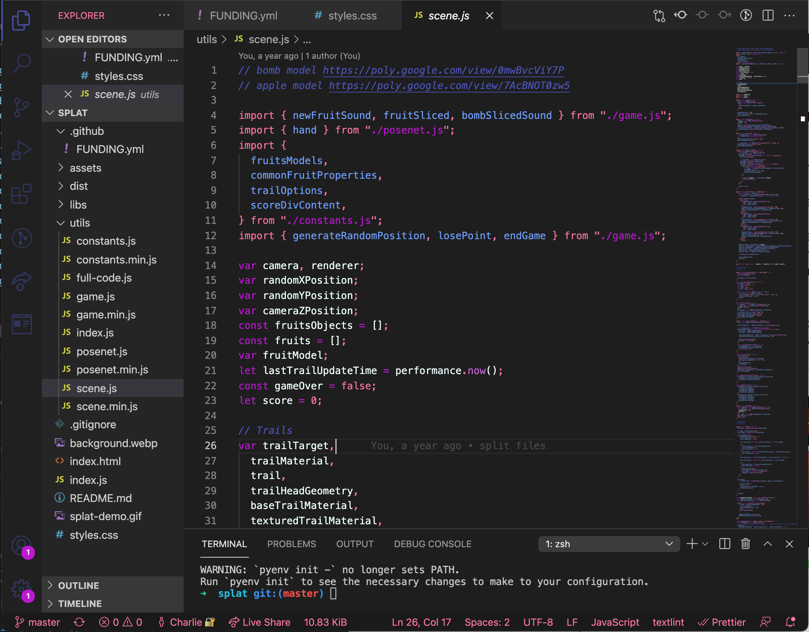
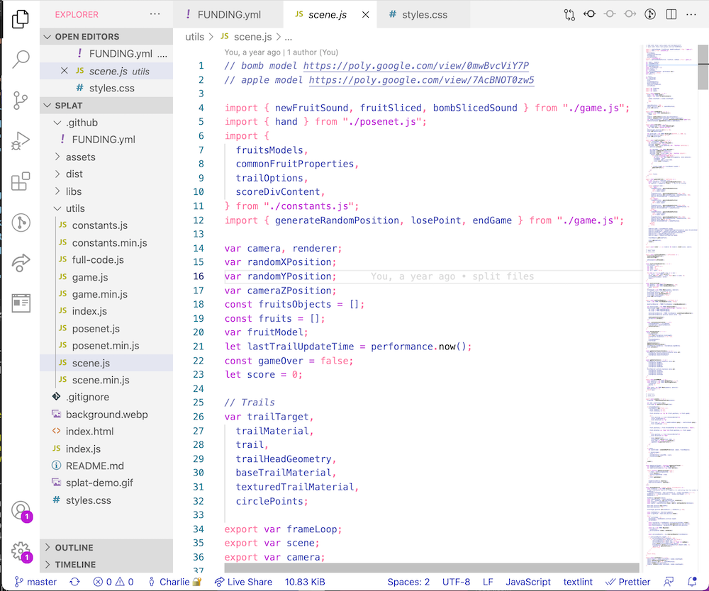
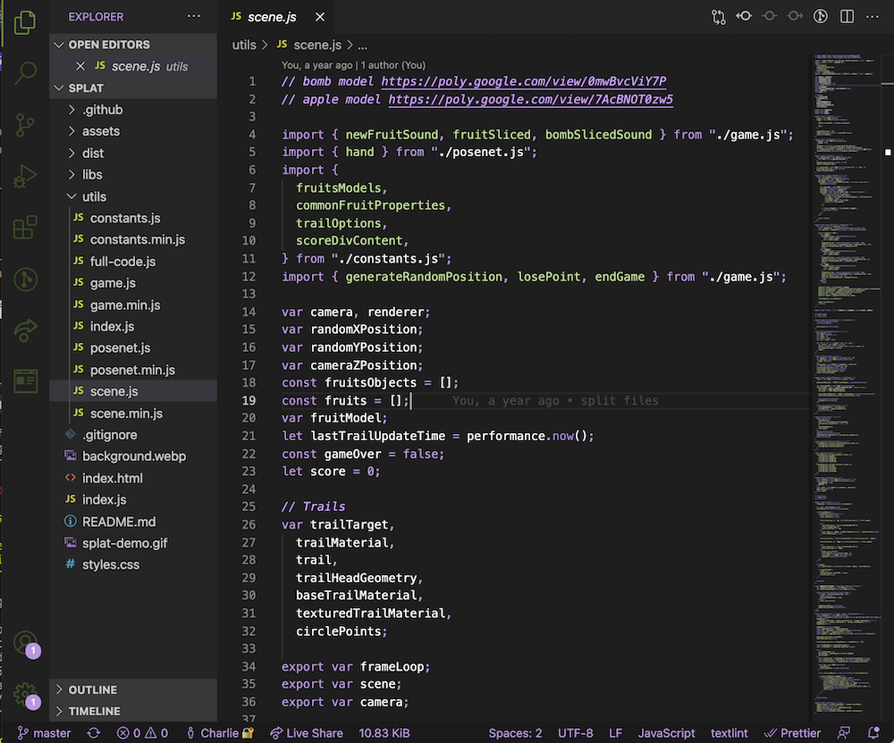
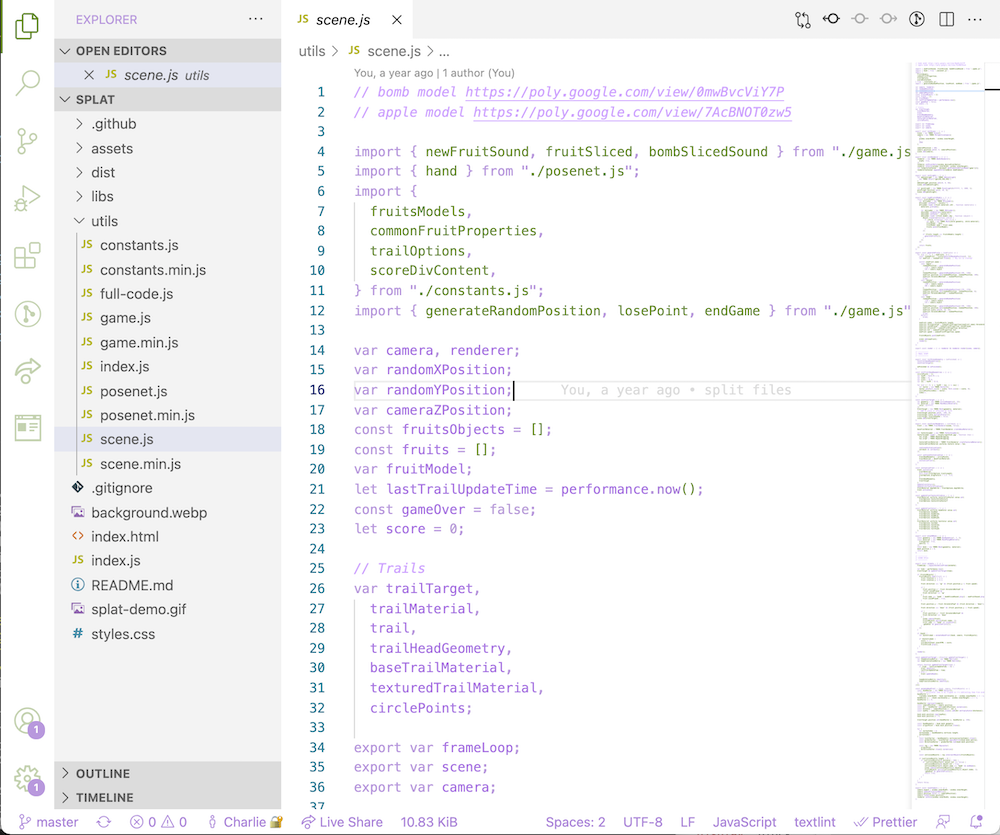
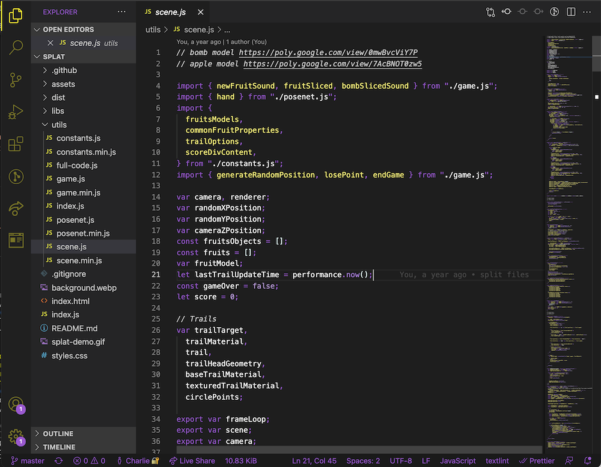
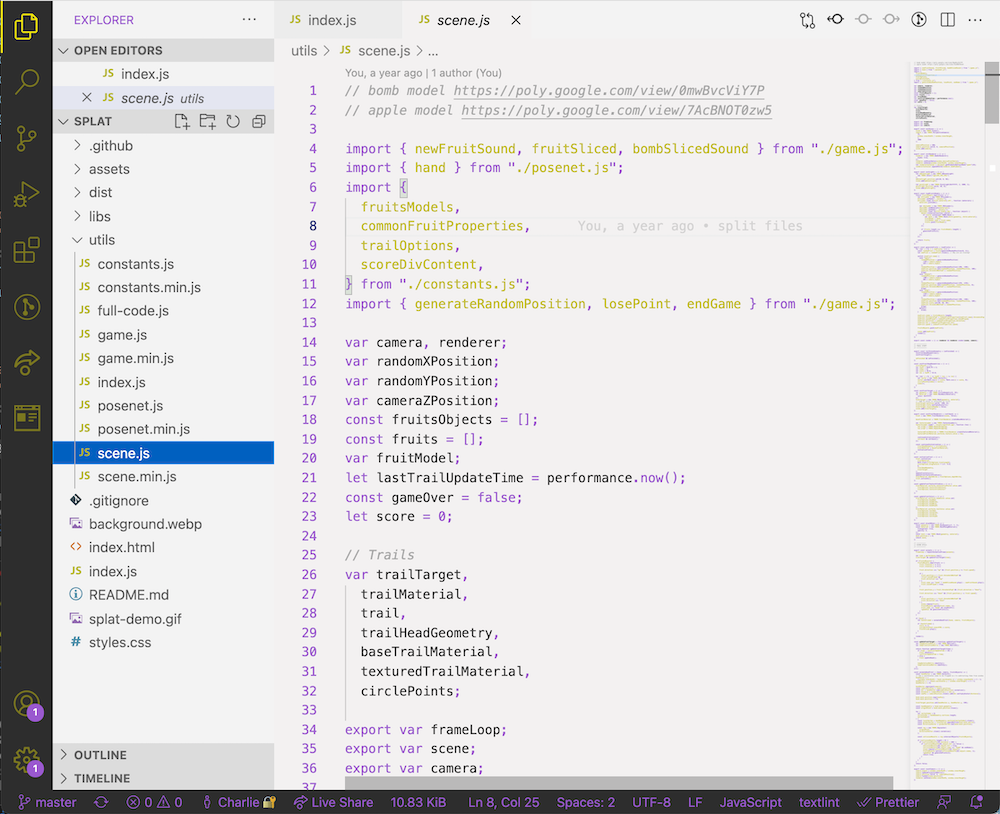

# Pride VSCode theme 🏳️‍🌈

## Themes available

- [Inclusive Pride flag](#inclusive-gay-flag)
- [Bisexual](#bisexual)
- [Pansexual](#pansexual)
- [Asexual](#asexual)
- [Transgender](#transgender)
- [Genderfluid](#genderfluid)
- [Genderqueer](#genderqueer)
- [Non-binary](#non-binary)

### Inclusive gay flag

Light mode:

Dark mode:

### Bisexual

Dark mode:

Light mode:

### Pansexual

Dark mode:

Light mode:

### Asexual

Dark mode:

Light mode:

### Transgender

Dark mode:

Light mode:

### Agender

Light mode:

Dark mode:

### Genderfluid

Dark mode:

Light mode:

### Genderqueer:

Dark mode:

Light mode:

### Non-binary:

Dark mode:

Light mode:

### Polysexual:

Light mode:

Dark mode:
