# Pride VSCode themes 🏳️‍🌈

## Themes available

_Not all genders and sexualities of the queer spectrum are represented here, only the ones I've had the time to make. Feel free to contribute to this repo if you'd like to add/modify a theme!_

- [Bisexual](#bisexual)
- [Pansexual](#pansexual)
- [Asexual](#asexual)
- [Transgender](#transgender)
- [Agender](#agender)
- [Genderfluid](#genderfluid)
- [Genderqueer](#genderqueer)
- [Non-binary](#non-binary)
- [Polysexual](#polysexual)

## Bisexual

Dark mode:

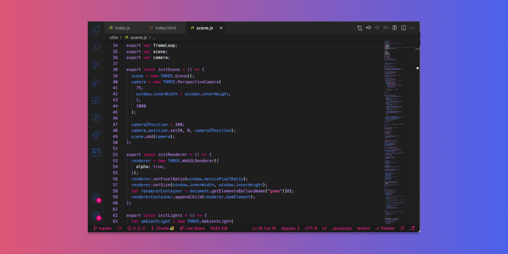

Light mode:

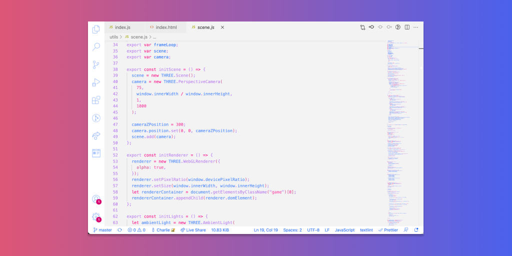

## Pansexual

Dark mode:

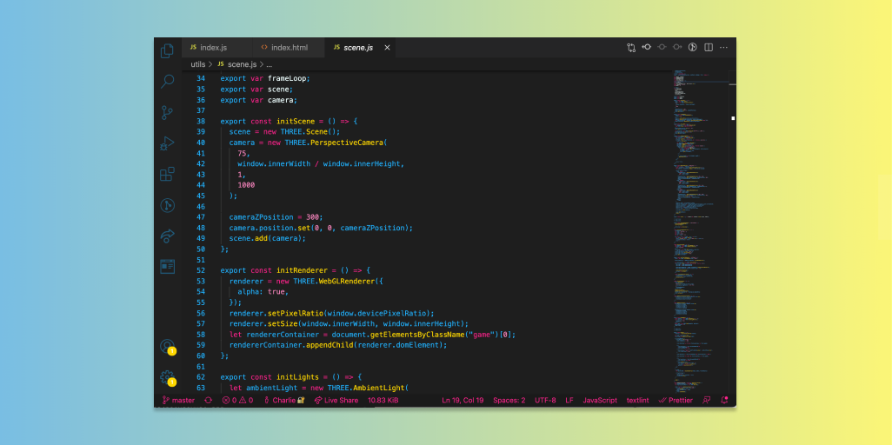

Light mode:

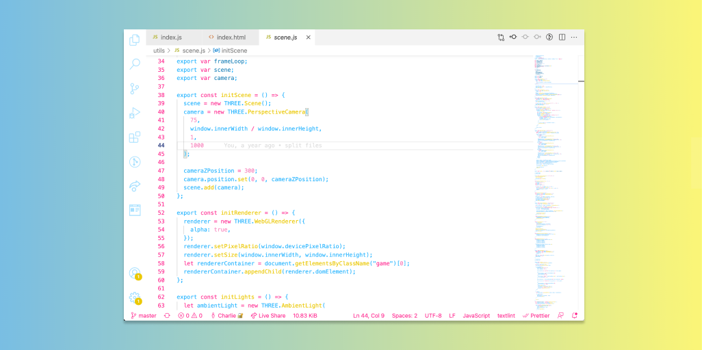

## Asexual

Dark mode:

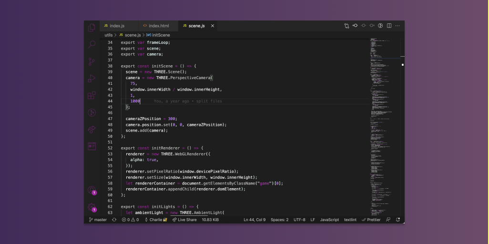

Light mode:

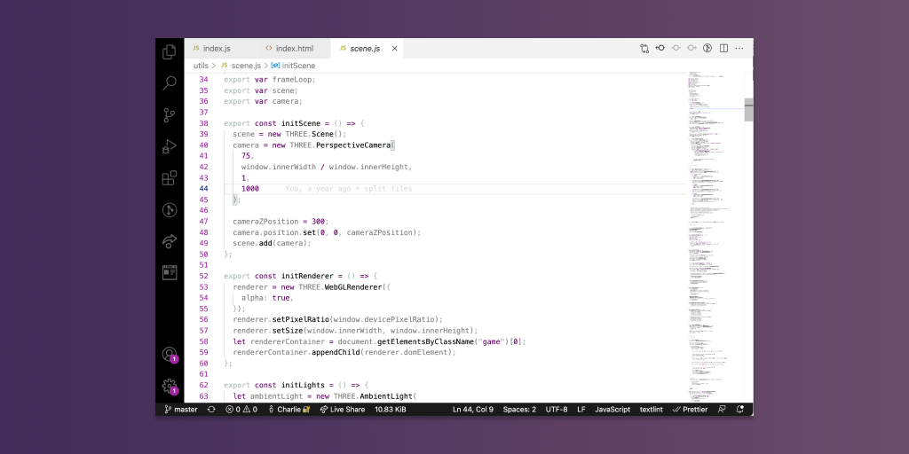

## Transgender

Dark mode:

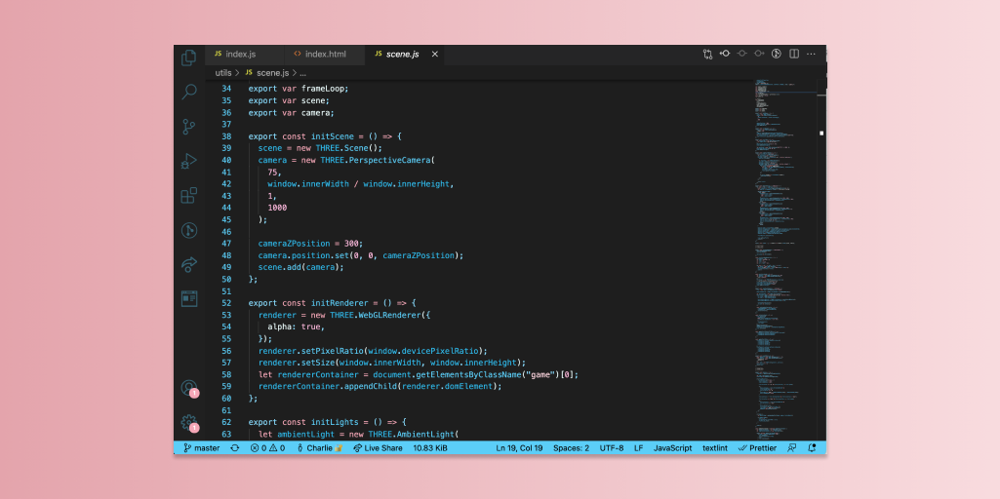

Light mode:

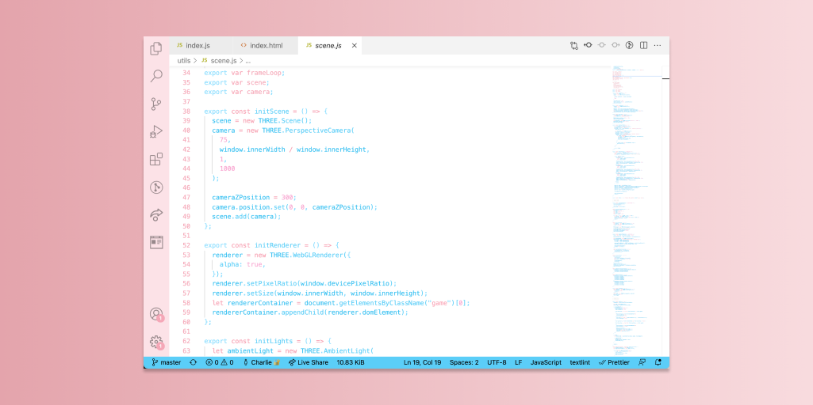

## Agender

Dark mode:

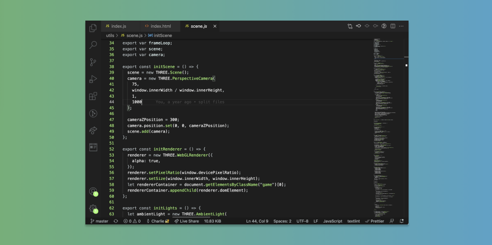

## Genderfluid

Dark mode:

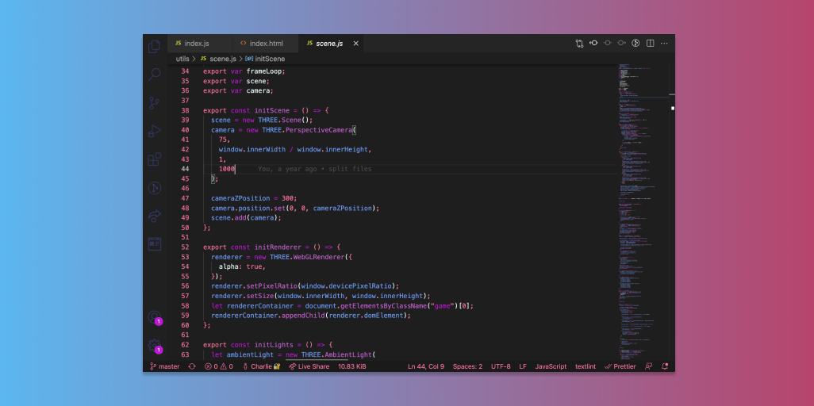

Light mode:

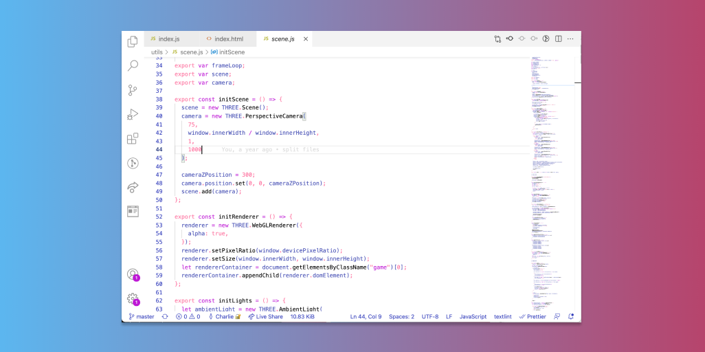

## Genderqueer:

Dark mode:

Light mode:

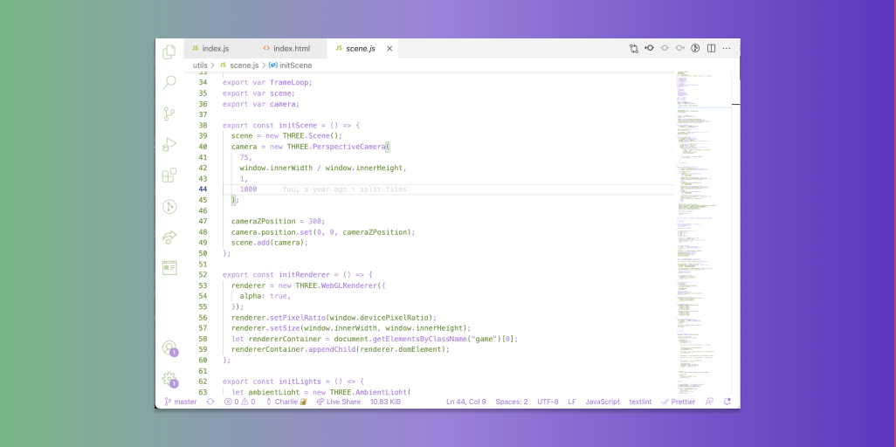

## Non-binary:

Dark mode:

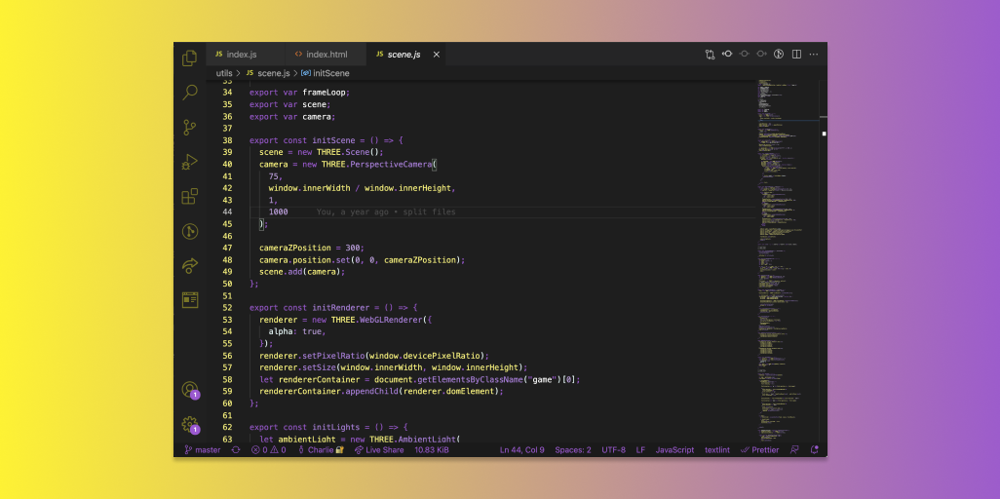

Light mode:

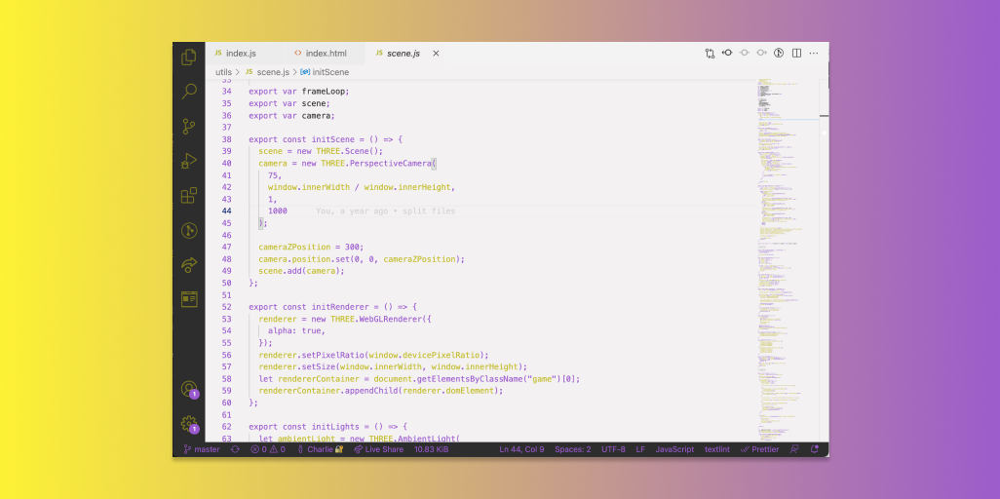

## Polysexual:

Dark mode:

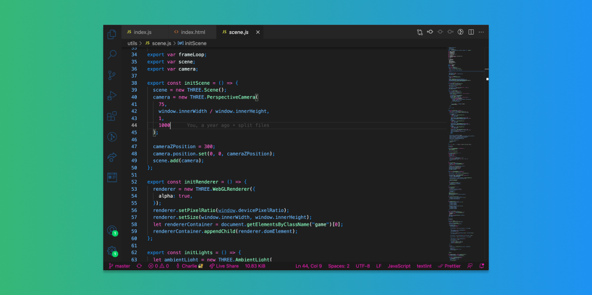
